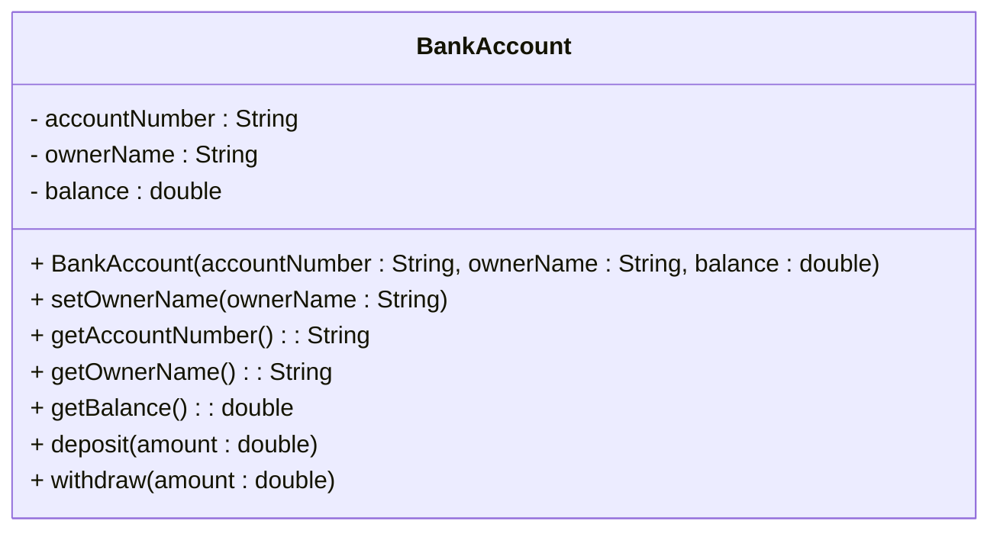
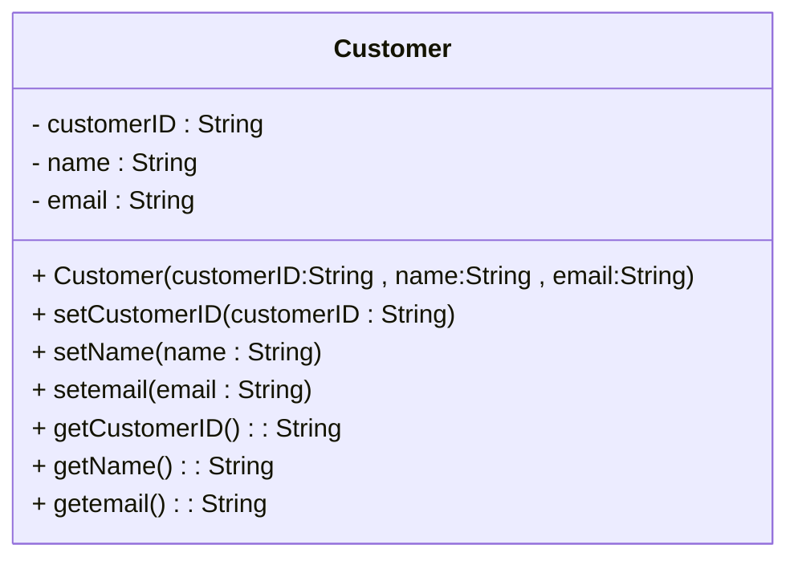
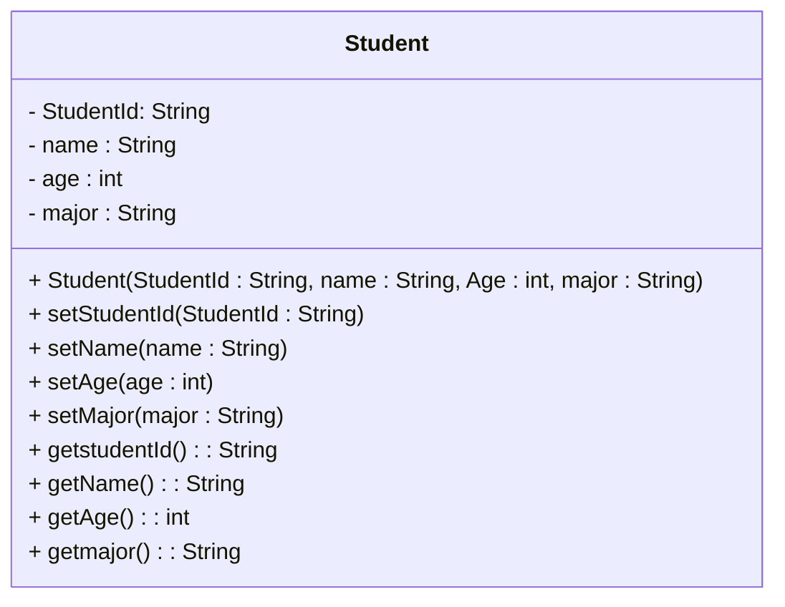
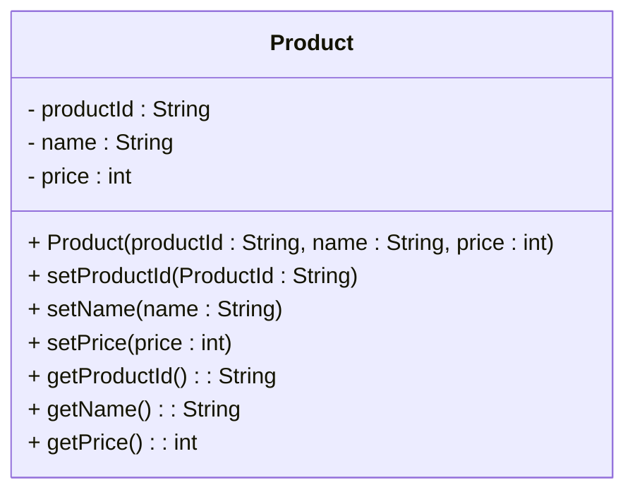
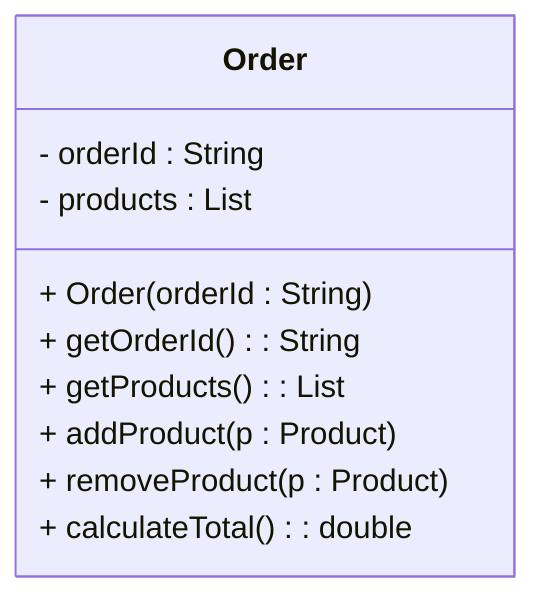

```mermaid
classDiagram
    class BankAccount {
        - accountNumber : String
        - ownerName : String
        - balance : double
        + BankAccount(accountNumber : String, ownerName : String, balance : double)
        + setOwnerName(ownerName : String)
        + getAccountNumber() : String
        + getOwnerName() : String
        + getBalance() : double
        + deposit(amount : double)
        + withdraw(amount : double)
    }
```

```mermaid
classDiagram
class Customer {
    - customerID : String
    - name : String
    - email : String
    + Customer(customerID:String , name:String , email:String)
    + setCustomerID(customerID : String)
    + setName(name : String)
    + setemail(email : String)
    + getCustomerID() : String
    + getName() : String
    + getemail() : String
    
}
```

```mermaid
classDiagram
class Student{
    - StudentId: String
    - name : String
    - age : int
    - major : String
    + Student(StudentId : String, name : String, Age : int, major : String)
    + setStudentId(StudentId : String)
    + setName(name : String)
    + setAge(age : int)
    + setMajor(major : String)
    + getstudentId() : String
    + getName(): String
    + getAge() : int
    + getmajor(): String
    
    

}
```

```mermaid
classDiagram
class Product{
    - productId : String
    - name : String
    - price : int
    + Product(productId : String, name : String, price : int)
    + setProductId(ProductId : String)
    + setName(name : String)
    + setPrice(price : int)
    + getProductId() : String
    + getName() : String
    + getPrice() : int
    
}
```

```mermaid
classDiagram
class Order{
- orderId : String            
 - products : List<Product>  
 + Order(orderId : String)      
 + getOrderId() : String       
 + getProducts() : List<Product>
 + addProduct(p : Product)      
 + removeProduct(p : Product)   
 + calculateTotal() : double    
}
```

      

    

